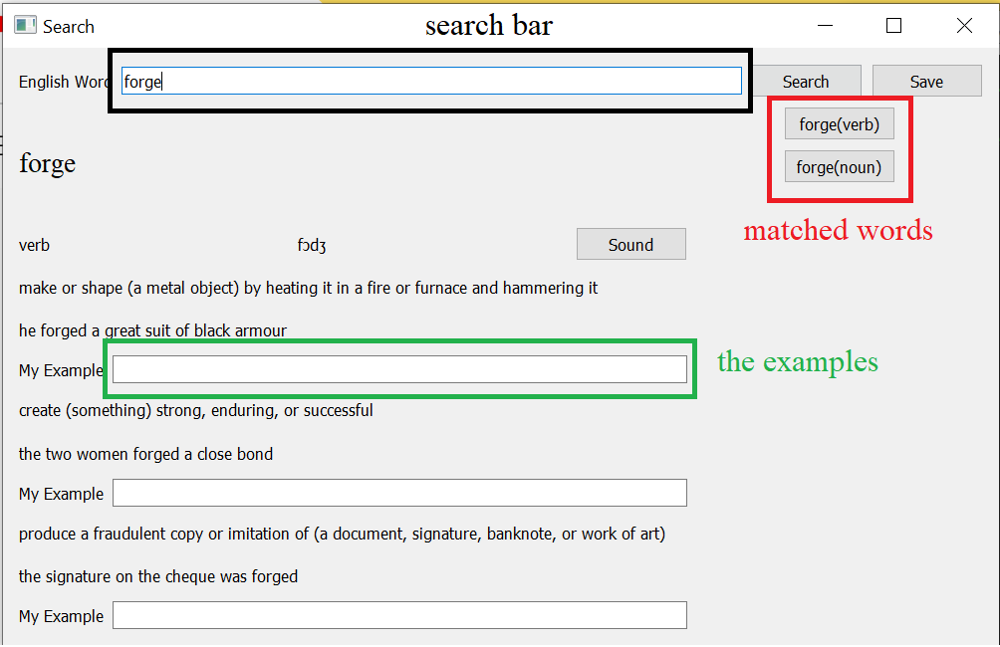

# Learning English App using OxfordDictionary

# How to install 

1. Clone from the github.
2. Run install.bat to install all the app (Also create the shortcut in the desktop).
3. Run by run.bat or click on the shortcut in the desktop.

``` python
    git clone https://github.com/threezinedine/LearningEnglishApp.git
    cd LearningEnglishApp\
    install.bat
```

# The search window.



- The word that you searched will be automated save in the database that will be called again later.
- You can also play the sound of this word (should wait 2s before making other).

# Shortcut

1. Shift M: sound
2. Enter: Search the word / The next word
